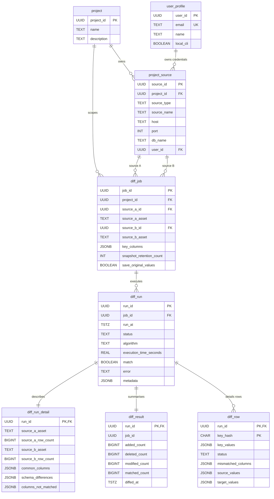

# PERSISTENCE.md

DiMer's optional persistence layer saves diff history. It runs on either **SQLite** (local, default at `~/.dimer/dimer.db`) or **PostgreSQL** (production, set via `DIMER_DB_URL`). Both backends share the same 8-table logical schema; only the column types differ.

> **Terminology — source vs target.** Tables use the **A/B** convention (`source_a_*`, `source_b_*`), while the domain models ([models.py](dimer/core/models.py)) use **source/target** (`source_values`, `target_row_count`, …). These are the same two things: *source* = source A = left side, *target* = source B = right side. "Target" is only a label for the second comparison input — a diff is read-only on both sides; nothing is ever written to a target destination.

> **Sources:** [sqlite_schema.sql](dimer/persistence/sql/sqlite_schema.sql) · [postgres_schema.sql](dimer/persistence/sql/postgres_schema.sql) · [repository.py](dimer/persistence/repository.py) · [models.py](dimer/core/models.py)

---

## 1. Schema parity check

| Table              | SQLite | PostgreSQL |
|--------------------|:------:|:----------:|
| `project`          | ✓      | ✓          |
| `user_profile`     | ✓      | ✓          |
| `project_source`   | ✓      | ✓          |
| `diff_job`         | ✓      | ✓          |
| `diff_run`         | ✓      | ✓          |
| `diff_run_detail`  | ✓      | ✓          |
| `diff_result`      | ✓      | ✓          |
| `diff_row`         | ✓      | ✓          |

All 8 tables are defined in both backends with the same columns and relationships.

---

## 2. ER diagram

### Relationship summary

- A **project** groups one or more **project_sources** (database connections) and **diff_jobs** (comparison configurations).
- A **user_profile** can own credentials for many project_sources. The CLI auto-creates a single `local_cli=true` user.
- A **diff_job** pins *two* `project_source` references (A and B) plus the table + key columns being compared. It is the immutable contract for repeat runs.
- Each **diff_run** is one execution of a `diff_job`. It fans out to exactly one **diff_run_detail** (historical asset metadata), one **diff_result** (aggregate counts), and zero-or-more **diff_row** entries (individual differing rows, capped by `MAX_DETAIL_ROWS`).

---

## 3. Data dictionary

Type column shows `SQLite / PostgreSQL`. PK = primary key, FK = foreign key, UK = unique.

### 3.1 `project`

Groups sources and jobs under a logical workspace. The CLI seeds a default project on first run (`ensure_defaults`).

| Column        | Type (SQLite / PG)    | Constraints | Description |
|---------------|-----------------------|-------------|-------------|
| `project_id`  | `TEXT` / `UUID`       | PK          | UUID; auto-generated on PG, supplied on SQLite. |
| `name`        | `TEXT` / `VARCHAR`    | NOT NULL    | Display name. |
| `description` | `TEXT` / `TEXT`       | nullable    | Free-form notes. |

### 3.2 `user_profile`

Owner of credentials for a `project_source`. Named `user_profile` (not `user`) because `user` is a reserved word in PostgreSQL and would need quoting everywhere.

| Column      | Type                  | Constraints     | Description |
|-------------|-----------------------|-----------------|-------------|
| `user_id`   | `TEXT` / `UUID`       | PK              | UUID. |
| `email`     | `TEXT` / `VARCHAR`    | UNIQUE          | Optional contact email. |
| `name`      | `TEXT` / `VARCHAR`    | NOT NULL        | Display name. |
| `local_cli` | `INTEGER` / `BOOLEAN` | NOT NULL, def 0/FALSE | `1`/`TRUE` for the auto-created CLI user. |

### 3.3 `project_source`

A connection definition (host/port/db) plus a human label, scoped to a project.

| Column        | Type                | Constraints | Description |
|---------------|---------------------|-------------|-------------|
| `source_id`   | `TEXT` / `UUID`     | PK          | UUID. |
| `project_id`  | `TEXT` / `UUID`     | FK → `project`, NOT NULL | Owning project. |
| `source_type` | `TEXT` / `VARCHAR`  | NOT NULL    | One of `snowflake`, `postgresql`, `mysql`, `bigquery`, `databricks`, `csv`, `parquet`. |
| `source_name` | `TEXT` / `VARCHAR`  | NOT NULL    | Human label (e.g. `"prod-warehouse"`). |
| `host`        | `TEXT` / `VARCHAR`  | nullable    | Hostname (omitted for file sources). |
| `port`        | `INTEGER` / `INTEGER` | nullable  | TCP port. |
| `db_name`     | `TEXT` / `VARCHAR`  | nullable    | Database/catalog name. |
| `user_id`     | `TEXT` / `UUID`     | FK → `user_profile` | Credential owner. |
|               |                     | UNIQUE      | `(project_id, source_type, source_name)` — `get_or_create_project_source` matches on this. |

### 3.4 `diff_job`

Immutable comparison contract: two sources + two table assets + sorted key columns. Re-running the same logical comparison reuses the same `job_id` (deduplicated by the UNIQUE constraint).

| Column                     | Type                  | Constraints | Description |
|----------------------------|-----------------------|-------------|-------------|
| `job_id`                   | `TEXT` / `UUID`       | PK          | UUID. |
| `project_id`               | `TEXT` / `UUID`       | FK → `project`, NOT NULL | Owning project. |
| `source_a_id`              | `TEXT` / `UUID`       | FK → `project_source`, NOT NULL | Left side. |
| `source_a_asset`           | `TEXT` / `VARCHAR`    | NOT NULL    | Fully-qualified table name on source A. |
| `source_b_id`              | `TEXT` / `UUID`       | FK → `project_source`, NOT NULL | Right side. |
| `source_b_asset`           | `TEXT` / `VARCHAR`    | NOT NULL    | Fully-qualified table name on source B. |
| `key_columns`              | `TEXT` / `JSONB`      | NOT NULL    | JSON array, e.g. `["id", "tenant_id"]`. Stored sorted to make uniqueness deterministic. |
| `snapshot_retention_count` | `INTEGER` / `INTEGER` | NOT NULL, def 10 | How many recent `diff_run`s to keep before `delete_old_runs` prunes. |
| `save_original_values`     | `INTEGER` / `BOOLEAN` | NOT NULL, def 0/FALSE | When true, `diff_row.source_values` / `target_values` are populated. |
|                            |                       | UNIQUE      | `(source_a_id, source_a_asset, source_b_id, source_b_asset, key_columns)`. |

### 3.5 `diff_run`

One execution of a `diff_job`. Algorithm-specific stats (e.g. bisection segment count and depth) live in `metadata`.

| Column                   | Type                    | Constraints | Description |
|--------------------------|-------------------------|-------------|-------------|
| `run_id`                 | `TEXT` / `UUID`         | PK          | UUID. |
| `job_id`                 | `TEXT` / `UUID`         | FK → `diff_job`, NOT NULL | Parent job. |
| `run_at`                 | `TEXT` / `TIMESTAMPTZ`  | NOT NULL    | ISO-8601 UTC on SQLite; native timestamp on PG. |
| `status`                 | `TEXT` / `VARCHAR`      | NOT NULL    | `'success'` or `'failed'`. |
| `algorithm`              | `TEXT` / `VARCHAR`      | nullable    | `'JOIN_DIFF'`, `'HASH_DIFF'`, `'FULL_FETCH_DIFF'`, or `'BISECTION'`. See [ALGO.md](ALGO.md). |
| `execution_time_seconds` | `REAL` / `DOUBLE PRECISION` | nullable | Wall-clock duration. |
| `match`                  | `INTEGER` / `BOOLEAN`   | nullable    | `1`/`TRUE` when the two tables are identical. |
| `error`                  | `TEXT` / `TEXT`         | nullable    | Error message when `status='failed'`. |
| `metadata`               | `TEXT` / `JSONB`        | nullable    | Algorithm-specific stats (e.g. `{"segments_compared": N, "max_depth": D}`). |

### 3.6 `diff_run_detail`

Historical snapshot of asset-level metadata captured at run time. Decoupled from `diff_job` so the job config can change without rewriting history.

| Column                | Type                   | Constraints | Description |
|-----------------------|------------------------|-------------|-------------|
| `run_id`              | `TEXT` / `UUID`        | PK, FK → `diff_run` | One row per run. |
| `source_a_asset`      | `TEXT` / `VARCHAR`     | nullable    | FQ name as it stood at run time. |
| `source_a_row_count`  | `INTEGER` / `BIGINT`   | nullable    | Total rows scanned on side A. |
| `source_b_asset`      | `TEXT` / `VARCHAR`     | nullable    | FQ name as it stood at run time. |
| `source_b_row_count`  | `INTEGER` / `BIGINT`   | nullable    | Total rows scanned on side B. |
| `common_columns`      | `TEXT` / `JSONB`       | nullable    | JSON array of column names present on both sides, e.g. `["id", "name", "amount"]`. |
| `schema_differences`  | `TEXT` / `JSONB`       | nullable    | `{"columns_only_in_a": [...], "columns_only_in_b": [...], "column_type_differences": [{"column": "amount", "table_a": {"type": "NUMERIC", "nullable": true}, "table_b": {"type": "TEXT", "nullable": false}}], "row_count_difference": N, "size_difference": N}`. |
| `columns_not_matched` | `TEXT` / `JSONB`       | nullable    | `{"source_a_only": [...], "source_b_only": [...]}` — derived from `schema_differences`; empty keys omitted, `NULL` when all columns match. |

### 3.7 `diff_result`

Aggregate counts for a run. 1:1 with `diff_run`; kept separate to allow cheap dashboards without scanning details.

| Column          | Type                  | Constraints | Description |
|-----------------|-----------------------|-------------|-------------|
| `run_id`        | `TEXT` / `UUID`       | PK, FK → `diff_run` | One row per run. |
| `job_id`        | `TEXT` / `UUID`       | NOT NULL    | Denormalised for fast per-job aggregates (not declared FK). |
| `added_count`   | `INTEGER` / `BIGINT`  | NOT NULL, def 0 | Rows in B but not A. |
| `deleted_count` | `INTEGER` / `BIGINT`  | NOT NULL, def 0 | Rows in A but not B. |
| `modified_count`| `INTEGER` / `BIGINT`  | NOT NULL, def 0 | Rows present on both sides with at least one differing non-key column. |
| `matched_count` | `INTEGER` / `BIGINT`  | NOT NULL, def 0 | Rows identical on both sides. |
| `diffed_at`     | `TEXT` / `TIMESTAMPTZ`| NOT NULL    | When the result was computed. |

### 3.8 `diff_row`

Per-row diff detail, capped by `MAX_DETAIL_ROWS` per run (configured in [repository.py](dimer/persistence/repository.py)).

| Column               | Type                | Constraints | Description |
|----------------------|---------------------|-------------|-------------|
| `run_id`             | `TEXT` / `UUID`     | PK (part 1), FK → `diff_run` | Parent run. |
| `key_hash`           | `TEXT` / `CHAR(32)` | PK (part 2), NOT NULL | `MD5` of sorted JSON of `key_values`. Stable shard for the composite PK. |
| `key_values`         | `TEXT` / `JSONB`    | NOT NULL    | Key column values, e.g. `{"id": 42, "tenant_id": "acme"}`. |
| `status`             | `TEXT` / `VARCHAR`  | NOT NULL    | `'added'`, `'deleted'`, or `'modified'` (see `RowStatus` in [models.py](dimer/core/models.py)). |
| `mismatched_columns` | `TEXT` / `JSONB`    | nullable    | JSON array; populated for `'modified'` rows only. |
| `source_values`      | `TEXT` / `JSONB`    | nullable    | Full source-side row; populated only when `diff_job.save_original_values` is true. |
| `target_values`      | `TEXT` / `JSONB`    | nullable    | Full target-side row; populated only when `diff_job.save_original_values` is true. |

---

## 4. Type-mapping cheat sheet

| Logical          | SQLite       | PostgreSQL    |
|------------------|--------------|---------------|
| UUID             | `TEXT` (36)  | `UUID` (`uuid_generate_v4()` default) |
| Boolean          | `INTEGER` 0/1| `BOOLEAN`     |
| Timestamp (UTC)  | `TEXT` ISO-8601 | `TIMESTAMPTZ` |
| JSON             | `TEXT`       | `JSONB`       |
| Large counts     | `INTEGER`    | `BIGINT`      |
| Float            | `REAL`       | `DOUBLE PRECISION` |

Placeholder normalisation (`?` vs `%s`) is handled by `DimerDB` in [repository.py](dimer/persistence/repository.py), so application code is portable across both backends.

---

## 5. Write path at a glance

`save_diff_run(db, result, job_id, ...)` in [repository.py](dimer/persistence/repository.py) writes, in order:

1. `diff_run` — including the algorithm `metadata` JSON.
2. `diff_run_detail` — historical asset metadata.
3. `diff_result` — aggregate counts.
4. `diff_row` — up to `MAX_DETAIL_ROWS` differing rows.

Pruning of older runs for the same job is delegated to `delete_old_runs(db, job_id, keep_count)`, which deletes children (`diff_row`, `diff_run_detail`, `diff_result`) before the parent `diff_run`.
